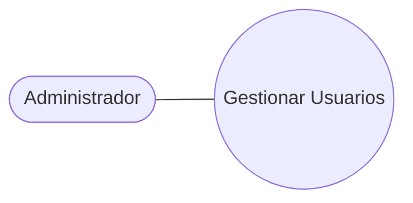
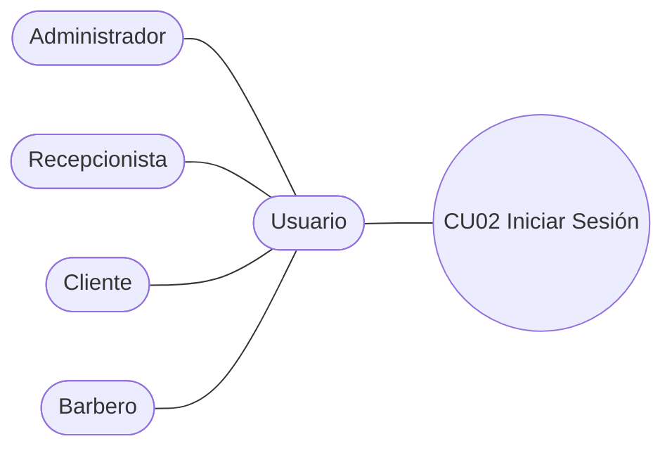

# 01 · Especificación de Casos de Uso — CU01 y CU02

Todo el contenido de este archivo es **[DEFINIDO]**: se transcribe tal como aparece en la entrega (Capítulo 2, sección 2.3 "Detallar Casos de Uso", Ciclo #1). Los diagramas originales están en `diagramas/`.

---

## CU01 — Gestionar Usuarios

**Diagrama de casos de uso (original):** `diagramas/CU01-casos-de-uso.png`

| Campo | Contenido |
|---|---|
| **Caso de Uso** | CU01 : Gestionar Usuarios |
| **Propósito** | Permitir que el Administrador pueda registrar, consultar, actualizar y deshabilitar cualquier usuario del sistema, para poder decidir quién accede al sistema y con qué rol. |
| **Descripción** | El administrador registra un nuevo empleado o cliente ingresando sus datos personales, credenciales y rol; deshabilita la cuenta de un empleado que dejó de trabajar; o actualiza los datos o la contraseña de un usuario que los olvidó. El sistema valida que el correo no esté repetido y que se haya asignado un rol antes de guardar, registra la acción en la bitácora y deja al usuario en el estado correspondiente (activo o inactivo). |
| **Actores** | Administrador |
| **Actor Iniciador** | Administrador |
| **Precondiciones** | 1. Haber iniciado sesión como administrador. 2. Que existan roles registrados en el sistema para asignar a los usuarios. |

### Flujo principal (registrar)

1. El administrador selecciona la opción "Gestionar usuarios".
2. El sistema muestra la lista de usuarios registrados con las opciones registrar, consultar, actualizar y deshabilitar.
3. El administrador selecciona "Registrar usuario".
4. El sistema muestra el formulario con los campos de datos personales, credenciales y rol.
5. El administrador ingresa los datos, selecciona el rol y presiona "Guardar".
6. El sistema valida que los campos obligatorios estén completos y que el correo no esté registrado.
7. El sistema guarda el usuario con estado activo, registra la acción en la bitácora y muestra el mensaje **"Usuario registrado correctamente"**.

### Flujos alternativos

| Paso | Flujo |
|---|---|
| **3a — Consultar** | Si el administrador selecciona "Consultar", el sistema muestra el detalle del usuario elegido y regresa al paso 2. |
| **3b — Actualizar** | Si el administrador selecciona "Actualizar", el sistema muestra el formulario con los datos actuales; el administrador los modifica y presiona "Guardar"; continúa en el paso 6. |
| **3c — Deshabilitar** | Si el administrador selecciona "Deshabilitar", el sistema solicita confirmación; al confirmar, cambia el estado del usuario a inactivo, registra la acción en la bitácora y regresa al paso 2. |

### Excepciones

| Paso | Excepción |
|---|---|
| **6a** | Si faltan campos obligatorios o el correo ya está registrado, el sistema muestra el mensaje de error correspondiente y regresa al paso 5. |

### Postcondiciones

- El usuario queda registrado, actualizado o deshabilitado en el sistema según la acción realizada.
- La acción quedó registrada en la bitácora.

### Requisito funcional asociado

> **RF1. Gestión de usuarios:** El sistema debe permitir al administrador registrar, modificar, consultar y desactivar los usuarios que tendrán acceso al sistema, incluyendo sus datos personales, credenciales y estado de la cuenta.

> **RF3. Gestión de roles y permisos:** El sistema debe permitir al administrador asignar a cada usuario uno de los roles definidos —Administrador, Recepcionista, Barbero o Cliente— y gestionar los permisos asociados a cada rol, los cuales determinan las funciones a las que se puede acceder.

### Operaciones que CU01 cubre (lectura para backend)

| Operación | Descripción en el CU | Efecto en bitácora |
|---|---|---|
| Listar | Paso 2 | No |
| Consultar detalle | 3a | No |
| Registrar | Pasos 3–7 | Sí |
| Actualizar (datos y/o contraseña) | 3b | Sí |
| Deshabilitar | 3c | Sí |

> No existe operación "Eliminar". El CU solo contempla deshabilitar (cambio de estado a inactivo). Ver `04-reglas-negocio-CU01.md`.

---

## CU02 — Iniciar Sesión

**Diagrama de casos de uso (original):** `diagramas/CU02-casos-de-uso.png`

> En el diagrama original, Administrador, Recepcionista, Cliente y Barbero son especializaciones del actor genérico **Usuario**, que es quien interactúa con el caso de uso.

| Campo | Contenido |
|---|---|
| **Caso de Uso** | CU02 : Iniciar Sesión |
| **Propósito** | Permitir que el usuario acceda al sistema de forma segura, validando sus credenciales, para habilitar las funciones correspondientes a su rol. |
| **Descripción** | El usuario ingresa correo y contraseña en la pantalla de inicio; el sistema valida que existan, coincidan y que la cuenta esté activa; si es correcto, registra el ingreso en bitácora y muestra el menú según su rol. |
| **Actores** | Administrador, Barbero, Recepcionista y Cliente |
| **Actor Iniciador** | Un usuario |
| **Precondiciones** | 1. Tener una cuenta registrada y activa. 2. No haber iniciado sesión. |

### Flujo principal

1. El usuario presiona el botón de "Iniciar Sesión".
2. El sistema muestra por pantalla el formulario de credenciales.
3. El usuario ingresa sus credenciales y confirma/presiona "Ingresar".
4. El sistema valida las credenciales, verifica que la cuenta esté activa y registra su inicio de sesión en la bitácora.
5. El sistema muestra al usuario por pantalla la interfaz y sus funciones correspondientes al rol y permisos asignados.

### Flujos alternativos / Excepciones

| Paso | Flujo |
|---|---|
| **4a** | Si las credenciales no son válidas o la cuenta está inactiva, el sistema muestra el mensaje **"Error al ingresar"** y regresa al paso 3. |

### Postcondiciones

- El usuario tiene una sesión activa con acceso a las funciones de su rol.
- El inicio de sesión quedó registrado en la bitácora.

### Requisitos funcionales asociados

> **RF2. Autenticación y control de sesión:** El sistema debe validar las credenciales (correo y contraseña) para autorizar el ingreso seguro, y debe permitir al usuario cerrar su sesión activa de forma segura.

> **RF5. Bitácora de auditoría:** El sistema debe registrar automáticamente las acciones críticas realizadas por los usuarios (inicios de sesión, anulaciones de ventas, ajustes de inventario y movimientos de caja), indicando usuario, fecha y hora exacta, para fines de seguridad y trazabilidad.

### Observaciones para backend

- El identificador de acceso es el **correo** (no hay "nombre de usuario"). Confirmado en descripción del CU, RF2 y tabla de prioridades ("autenticarse con su correo y contraseña").
- El mensaje de error es único y genérico ("Error al ingresar") tanto para correo inexistente, contraseña incorrecta o cuenta inactiva. Esto es deseable: no revela si el correo existe.
- RF2 incluye **cerrar sesión** de forma segura, aunque el CU02 no lo detalla como paso. Se contempla como endpoint en `05-reglas-negocio-CU02.md`.
- El paso 5 ("muestra la interfaz según rol y permisos") implica que la respuesta de autenticación debe devolver los roles y permisos efectivos del usuario para que el frontend pueda construir el menú (cuando se implemente).

---

## Diagramas de secuencia y actividad

**No se incluyen en esta iteración por decisión explícita.** Se agregarán más adelante. No generarlos.
