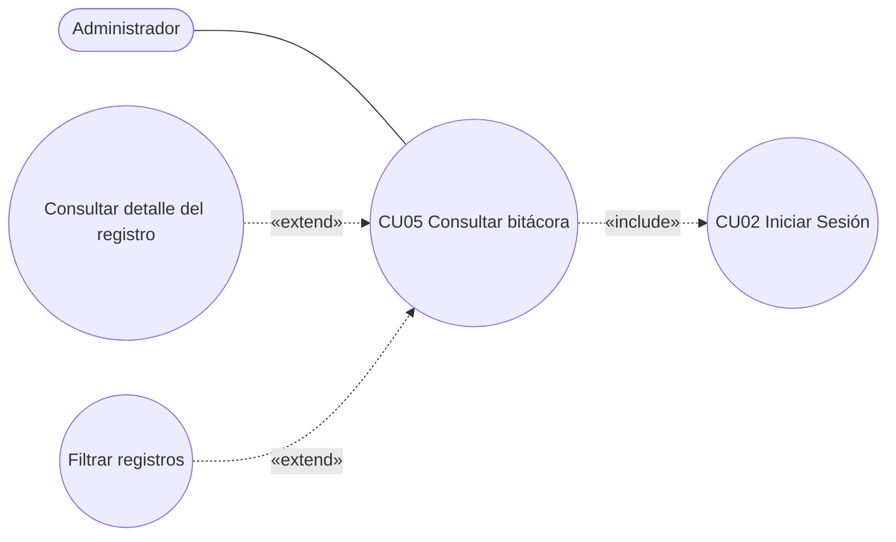

# 01 · Especificación del Caso de Uso — CU05

Contenido **[DEFINIDO]** (versión corregida, 27/09/2026). Diagrama corregido en `diagramas/CU05-diagrama-corregido.png`; el original se conserva como `CU05-casos-de-uso.png`.

## CU05 — Consultar Bitácora

| Campo | Contenido |
|---|---|
| **Caso de Uso** | CU05 : Consultar Bitácora |
| **Propósito** | Permitir que el Administrador consulte las acciones críticas registradas en el sistema para controlar las operaciones realizadas por los usuarios y mantener la trazabilidad de la información. |
| **Descripción** | El Administrador accede a la bitácora para revisar el historial de acciones registradas en el sistema. Puede consultar todos los registros, aplicar filtros y revisar el detalle de una acción específica. El sistema muestra el usuario responsable, la acción realizada, la tabla afectada, la fecha y hora, la dirección IP y los datos modificados cuando corresponda. La consulta no modifica ningún registro. |
| **Actores** | Administrador |
| **Actor Iniciador** | Administrador |
| **Precondiciones** | El Administrador debe tener una cuenta activa y haber iniciado sesión. |

### Flujo principal

1. El Administrador selecciona la opción "Consultar Bitácora".
2. El sistema verifica que el Administrador tenga permiso para realizar la consulta.
3. El sistema muestra los registros ordenados desde el más reciente.
4. El Administrador ingresa uno o varios criterios de búsqueda: rango de fechas, usuario, acción o tabla afectada.
5. El Administrador presiona el botón "Buscar".
6. El sistema valida los criterios ingresados.
7. El sistema consulta los registros que coinciden con los filtros.
8. El sistema muestra, ordenados desde el más reciente, la fecha y hora, el usuario responsable, la acción realizada, el detalle y la tabla afectada de cada registro.
9. El Administrador selecciona un registro.
10. El sistema muestra la información completa del registro, incluyendo los datos anteriores, los datos nuevos y la dirección IP de origen.
11. El Administrador revisa la información y finaliza la consulta.

### Flujos secundarios

| Paso | Flujo |
|---|---|
| **2a** | Si el usuario no tiene permiso, el sistema muestra el mensaje **"No tiene permiso para consultar la bitácora"** y finaliza el caso de uso. |
| **4a** | Si el Administrador no ingresa filtros, el sistema mantiene visibles todos los registros disponibles y continúa en el paso 8. |
| **6a** | Si la fecha inicial es posterior a la fecha final, el sistema muestra el mensaje **"La fecha inicial no puede ser posterior a la fecha final"** y regresa al paso 4. |
| **7a** | Si no existen registros que coincidan con los filtros, el sistema muestra el mensaje **"No se encontraron registros"** y regresa al paso 4. |
| **7b** | Si ocurre un error durante la consulta, el sistema muestra el mensaje **"No fue posible consultar la bitácora"** y permite volver a intentarlo. |
| **10a** | Si el registro no tiene datos anteriores o datos nuevos (por ejemplo, un inicio de sesión), el sistema muestra **"Sin datos"** en esos campos. |

### Postcondición

- El Administrador ha consultado el historial o el detalle de una acción registrada.
- Los registros de la bitácora permanecen sin modificaciones.

### Requisito funcional asociado

> **RF5. Bitácora de auditoría:** El sistema debe registrar automáticamente las acciones críticas realizadas por los usuarios (inicios de sesión, anulaciones de ventas, ajustes de inventario y movimientos de caja), indicando usuario, fecha y hora exacta, para fines de seguridad y trazabilidad.

### Operaciones para backend

| Operación | Pasos |
|---|---|
| Listar registros (con o sin filtros), paginado, más reciente primero | 3–8, 4a |
| Ver detalle de un registro | 9–10 |
| Obtener opciones para los filtros (acciones y tablas existentes) | apoyo al paso 4 |

## Diagramas de secuencia y actividad

No se incluyen en esta iteración. No generarlos.
