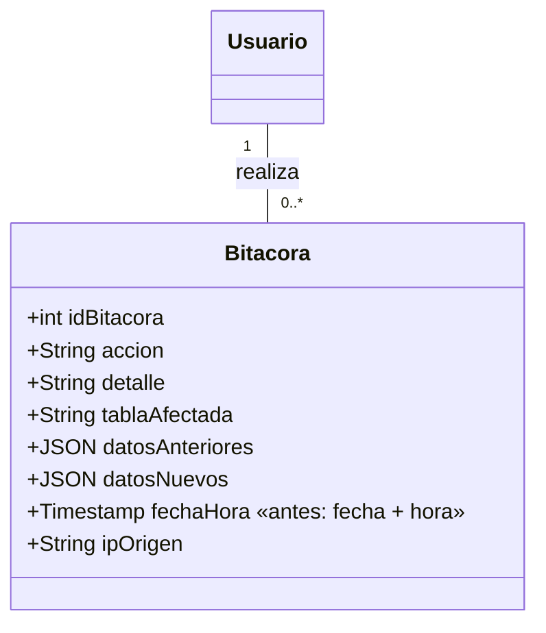

# 03 · Modelo de Datos — CU05

## 1. DDL de la entrega — [DEFINIDO]

```sql
CREATE TABLE bitacora (
    id_bitacora         SERIAL          PRIMARY KEY,
    usuario_id          INTEGER         NOT NULL REFERENCES usuario(id_usuario),
    accion              VARCHAR(50)     NOT NULL,
    detalle             VARCHAR(200),
    tabla_afectada      VARCHAR(50)     NOT NULL,
    datos_anteriores    JSONB,
    datos_nuevos        JSONB,
    fecha_hora          TIMESTAMP       NOT NULL DEFAULT NOW(),
    ip_origen           INET
);
```

## 2. ¿El diagrama de clases actual alcanza para CU05?

Sí, con un ajuste de coherencia. Todos los datos que el CU muestra existen: usuario (por la relación con `USUARIO`), acción, detalle, tabla afectada, fecha y hora, IP, datos anteriores y nuevos.

| Cambio | Por qué |
|---|---|
| **BITACORA: reemplazar `fecha` y `hora` por `fechaHora : Timestamp`** | El DDL ya usa una sola columna `fecha_hora`. Con dos atributos separados, filtrar por rango de fechas y ordenar "desde el más reciente" es más complicado. |
| BITACORA: `IPOrigen` → `ipOrigen` | Cosmético, para seguir la misma convención que los demás atributos. |



## 3. Índices — [PROPUESTO]

`CU01-CU02/03-modelo-de-datos.md` ya propuso `idx_bitacora_usuario_fecha` e `idx_bitacora_accion`. Para CU05 agregar:

```sql
CREATE INDEX IF NOT EXISTS idx_bitacora_fecha  ON bitacora (fecha_hora DESC);
CREATE INDEX IF NOT EXISTS idx_bitacora_tabla  ON bitacora (tabla_afectada);
```

La bitácora crece con cada inicio de sesión y cada operación; sin índice por fecha, el listado inicial (paso 3) se vuelve lento.

## 4. Bitácora de solo inserción — [PROPUESTO]

La postcondición exige que los registros permanezcan sin modificaciones. Reforzarlo en la BD, no solo en la aplicación:

```sql
CREATE OR REPLACE FUNCTION fn_bitacora_inmutable()
RETURNS TRIGGER AS $$
BEGIN
    RAISE EXCEPTION 'La bitácora no admite modificaciones ni eliminaciones';
END;
$$ LANGUAGE plpgsql;

CREATE TRIGGER trg_bitacora_inmutable
BEFORE UPDATE OR DELETE ON bitacora
FOR EACH ROW EXECUTE FUNCTION fn_bitacora_inmutable();
```

Consecuencia: `usuario` nunca podrá borrarse físicamente si tiene registros en bitácora. Ya era así por la FK y porque CU01 no permite borrar usuarios.

## 5. JPA — [PROPUESTO]

- La entidad `Bitacora` ya existe (CU01). Para CU05 marcarla como solo lectura en la consulta: usar proyecciones o DTO, o `@Transactional(readOnly = true)` en el servicio de consulta.
- Relación `@ManyToOne(fetch = LAZY)` a `Usuario` para obtener nombre y correo del responsable. En el listado usar un `JOIN FETCH` o una proyección para evitar N+1.
- Filtros dinámicos con `Specification<Bitacora>` (JPA Criteria), ya que todos los criterios son opcionales y combinables.
- `datos_anteriores`/`datos_nuevos` se devuelven como objeto JSON (no como texto escapado): mapear a `JsonNode` o `Map<String,Object>`.
- `ip_origen` es `INET`: leerlo como `String`.
