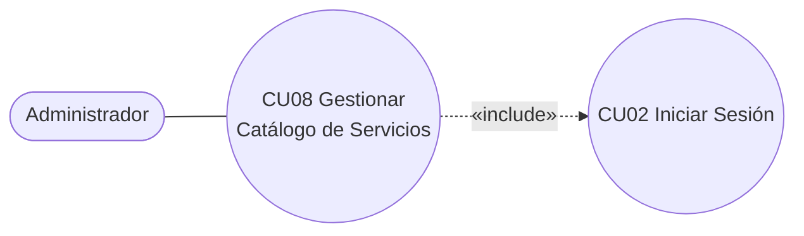

# 01 · Especificación del Caso de Uso — CU08

Todo el contenido de este archivo es **[DEFINIDO]**: se transcribe tal como aparece en la entrega (Capítulo 2, sección 2.3). El diagrama original está en `diagramas/CU08-casos-de-uso.png`.

---

## CU08 — Gestionar Catálogo de Servicios

| Campo | Contenido |
|---|---|
| **Caso de Uso** | CU08 : Gestionar Catálogo de Servicios |
| **Propósito** | Permitir que el administrador registre, modifique y deshabilite los servicios ofrecidos por la barbería, manteniendo actualizado el catálogo que se utiliza para reservas y ventas. |
| **Descripción** | El administrador accede al catálogo de servicios para registrar uno nuevo, modificar los datos de uno existente o cambiar su estado (habilitado/inhabilitado). Para cada servicio, el sistema gestiona su nombre, descripción, precio y porcentaje de comisión. Los cambios quedan disponibles de inmediato para los módulos de reservas y ventas. |
| **Actores** | Administrador |
| **Actor Iniciador** | Administrador |
| **Precondiciones** | 1. El Administrador debe tener una cuenta activa. 2. Debe haber iniciado sesión. |

### Flujo principal

1. El Administrador selecciona la opción "Gestionar Catálogo de Servicios".
2. El sistema verifica que el Administrador tenga permiso para gestionar el catálogo.
3. El sistema muestra el listado de servicios registrados, con su nombre, precio, porcentaje de comisión y estado.
4. El Administrador selecciona la acción a realizar: registrar un nuevo servicio, modificar uno existente o cambiar su estado.
5. Si elige registrar, el sistema muestra un formulario vacío; si elige modificar, el sistema muestra el formulario con los datos actuales del servicio seleccionado.
6. El Administrador ingresa o edita el nombre, la descripción, el precio y el porcentaje de comisión del servicio.
7. El Administrador presiona el botón "Guardar".
8. El sistema valida los datos ingresados.
9. El sistema guarda el servicio (nuevo o modificado) en el catálogo.
10. El sistema muestra el mensaje **"Servicio guardado correctamente"** y actualiza el listado.

### Flujos alternativos y excepciones

| Paso | Flujo |
|---|---|
| **4a — Cambiar estado** | Si el Administrador elige cambiar el estado de un servicio, el sistema alterna entre "habilitado" e "inhabilitado" y continúa en el paso 9, sin mostrar el formulario. |
| **8a — Nombre repetido** | Si el nombre del servicio ya existe en el catálogo, el sistema muestra el mensaje **"Ya existe un servicio con ese nombre"** y regresa al paso 6. |
| **8b — Valor inválido** | Si el precio o el porcentaje de comisión ingresado es negativo o no numérico, el sistema muestra el mensaje **"El valor ingresado no es válido"** y regresa al paso 6. |
| **8c — Campos vacíos** | Si algún campo obligatorio queda vacío, el sistema muestra el mensaje **"Debe completar todos los campos obligatorios"** y regresa al paso 6. |
| **9a — Error al guardar** | Si ocurre un error al guardar, el sistema muestra el mensaje **"No fue posible guardar el servicio"** y permite volver a intentarlo. |

### Postcondiciones

- El servicio queda registrado, modificado o con su estado actualizado en el catálogo.
- Los cambios están disponibles de inmediato para los módulos de reservas y ventas.

### Requisitos funcionales asociados

> **RF8. Gestión del catálogo de servicios:** El sistema debe permitir al administrador registrar, consultar, actualizar y deshabilitar los servicios ofrecidos por la barbería, definiendo nombre, descripción, precio, porcentaje de comisión y estado (habilitado/inhabilitado).

> **RF17. Cálculo de comisiones por servicios:** El sistema debe calcular automáticamente la comisión de cada barbero por servicio realizado, aplicando el porcentaje configurado en el servicio según su tipo y precio (actualmente entre 40% y 50% para las tarifas de Bs. 30, Bs. 40 y Bs. 60).

> **RF12. Consulta pública de disponibilidad y servicios:** El sistema debe permitir a cualquier visitante del sitio web, sin requerir autenticación, consultar el catálogo de servicios con sus precios y la disponibilidad de horarios de cada barbero. *(Relacionado, pero es otro CU; fuera de alcance aquí.)*

### Operaciones que CU08 cubre (lectura para backend)

| Operación | Paso del CU | ¿Muestra formulario? |
|---|---|---|
| Listar servicios | 3 | No |
| Consultar un servicio (para precargar el formulario de modificar) | 5 | — |
| Registrar | 4–10 | Sí |
| Modificar | 4–10 | Sí |
| Cambiar estado (habilitar/inhabilitar) | 4a → 9 → 10 | No |

> No existe operación "Eliminar". El CU solo contempla inhabilitar.

---

## Diagramas de secuencia y actividad

**No se incluyen en esta iteración por decisión explícita.** No generarlos.
