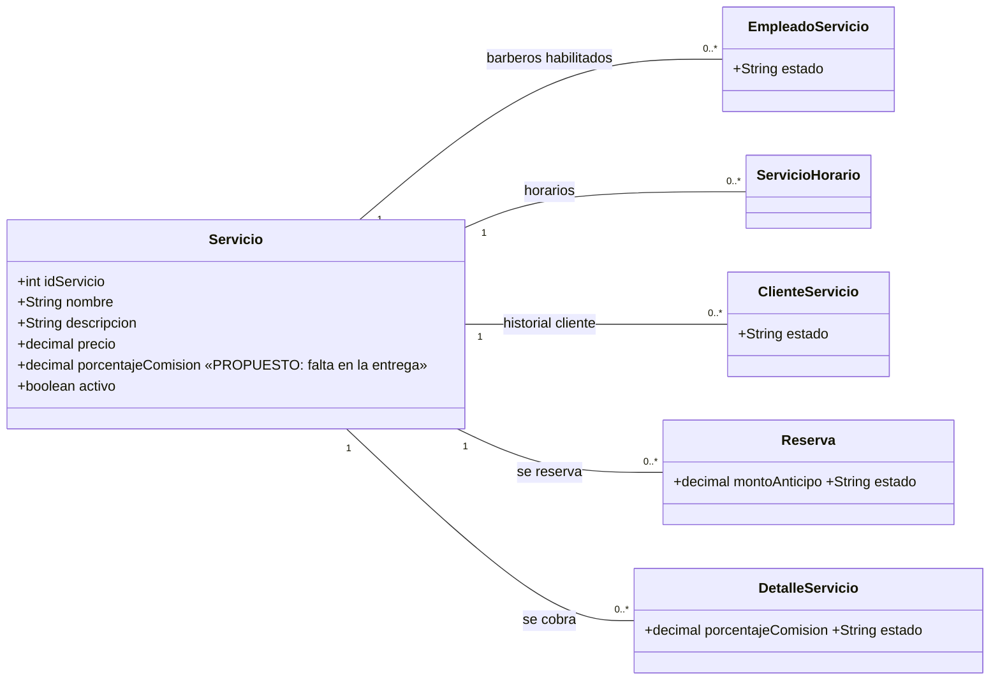

# 03 · Modelo de Datos — Servicio

Fuente: entrega, Capítulo 4 (diagrama de clases, DDL PostgreSQL, población de datos). El diagrama de clases completo está en `../CU01-CU02/diagramas/diagrama-clases-completo.png`.

---

## 1. Diagrama de clases (subconjunto) — [DEFINIDO], con un atributo [PROPUESTO]



CU08 **solo escribe en `servicio`**. Las demás clases se muestran porque dependen de él (ver reglas de impacto en `04-reglas-negocio-CU08.md` §4). No crear endpoints para ellas en este CU.

---

## 2. DDL actual y cambios necesarios

### 2.1 DDL de la entrega — [DEFINIDO]

```sql
CREATE TABLE servicio (
    id_servicio     SERIAL          PRIMARY KEY,
    nombre          VARCHAR(80)     NOT NULL,
    descripcion     VARCHAR(200),
    precio          NUMERIC(10,2)   NOT NULL CHECK (precio >= 0),
    activo          BOOLEAN         NOT NULL DEFAULT TRUE
);
```

### 2.2 Migración requerida — [PROPUESTO]

```sql
-- 1) Porcentaje de comisión por servicio (exigido por CU08, RF8 y RF17)
ALTER TABLE servicio
    ADD COLUMN porcentaje_comision NUMERIC(5,2) NOT NULL DEFAULT 0
        CHECK (porcentaje_comision BETWEEN 0 AND 100);

-- 2) Nombre único sin distinguir mayúsculas ni espacios extremos (flujo 8a)
CREATE UNIQUE INDEX ux_servicio_nombre ON servicio (LOWER(TRIM(nombre)));
```

Justificación:

- `NUMERIC(5,2)` y el rango `0–100` se copian de `detalle_servicio.porcentaje_comision`, que es donde ese valor se "congela" al cobrar. Mantener el mismo tipo evita conversiones.
- El `DEFAULT 0` solo sirve para que la migración no falle con filas existentes; inmediatamente después se cargan los valores reales (§4).
- El índice único usa `LOWER(TRIM())` para que "Corte Clásico" y "corte clásico " se consideren el mismo nombre.

Si el proyecto usa Flyway/Liquibase, esto va en una migración nueva (no editar la de creación original). Si usa `ddl-auto`, **no confiar en Hibernate** para el índice funcional: crearlo por script.

---

## 3. Diccionario de datos — `servicio`

| Atributo | Tipo | Nulo | Descripción | Notas backend |
|---|---|---|---|---|
| id_servicio | SERIAL | No | identificador único | PK |
| nombre | VARCHAR(80) | No | nombre del servicio | Obligatorio. Único (case-insensitive) |
| descripcion | VARCHAR(200) | **Sí** | detalle del servicio | Opcional según DDL (ver regla en `04` §1) |
| precio | NUMERIC(10,2) | No | tarifa en Bs | `>= 0`, 2 decimales |
| porcentaje_comision | NUMERIC(5,2) | No | % que gana el barbero | **Nuevo**. `0–100`, 2 decimales |
| activo | BOOLEAN | No | habilitado / inhabilitado | `true` = HABILITADO |

---

## 4. Semilla — [DEFINIDO] los 10 servicios; porcentajes derivados

La entrega inserta 10 servicios sin porcentaje. Los porcentajes se **derivan de la semilla de `detalle_servicio`**, que siempre usa el mismo valor para cada servicio (coherente con RF17: 40–50% según precio).

| id | nombre | precio (Bs) | % comisión | Origen del % |
|---|---|---|---|---|
| 1 | Corte Clásico | 30.00 | 40.00 | [DEFINIDO] en detalle_servicio |
| 2 | Corte Degradado (Fade) | 40.00 | 40.00 | [DEFINIDO] |
| 3 | Perfilado de Barba | 30.00 | 40.00 | [DEFINIDO] |
| 4 | Afeitado Completo a Navaja | 35.00 | 40.00 | [DEFINIDO] |
| 5 | Combo Corte + Barba | 60.00 | 45.00 | [DEFINIDO] |
| 6 | Corte Infantil | 25.00 | 40.00 | [DEFINIDO] |
| 7 | Perfilado de Cejas | 20.00 | 40.00 | **[PROPUESTO]** (no aparece en ninguna venta; se aplica el mínimo del rango) |
| 8 | Tinte de Barba / Cabello | 50.00 | 50.00 | [DEFINIDO] |
| 9 | Limpieza Facial Express | 45.00 | 45.00 | [DEFINIDO] |
| 10 | Combo Premium (Corte + Barba + Facial) | 110.00 | 50.00 | [DEFINIDO] |

```sql
UPDATE servicio SET porcentaje_comision = 40.00 WHERE id_servicio IN (1,2,3,4,6,7);
UPDATE servicio SET porcentaje_comision = 45.00 WHERE id_servicio IN (5,9);
UPDATE servicio SET porcentaje_comision = 50.00 WHERE id_servicio IN (8,10);
```

---

## 5. Guía de mapeo JPA — [PROPUESTO]

- Entidad `Servicio` en `modulo_servicios_reservas`.
- `precio` y `porcentajeComision` como `BigDecimal` con `@Column(precision=10, scale=2)` y `@Column(precision=5, scale=2)`. **Nunca `double`** (es dinero).
- `activo` como `boolean`. Exponer en la API un enum `EstadoServicio { HABILITADO, INHABILITADO }` calculado a partir de `activo`, para respetar el vocabulario del CU.
- No mapear las colecciones inversas (`empleadoServicios`, `reservas`, etc.) en esta iteración; no se necesitan y provocan cargas innecesarias.
- Repositorio: `existsByNombreIgnoreCase(String)` y `existsByNombreIgnoreCaseAndIdServicioNot(String, Integer)` para validar unicidad al crear y al modificar. El índice único de BD es la red de seguridad ante condiciones de carrera.
