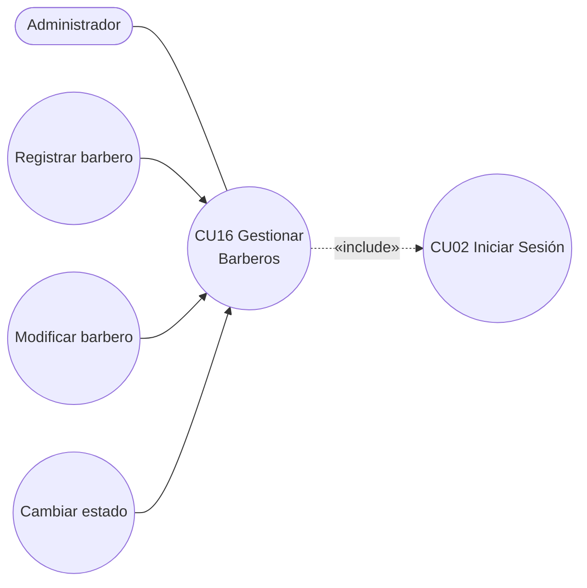

# 01 · Especificación del Caso de Uso — CU16

Todo el contenido de este archivo es **[DEFINIDO]**: se transcribe tal como aparece en la entrega.

---

## CU16 — Gestionar Barberos

| Campo | Contenido |
|---|---|
| **Caso de Uso** | CU16 : Gestionar Barberos |
| **Propósito** | Facilitar la administración de barberos por parte del usuario administrador, permitiendo el alta, edición, consulta y actualización de estado (activo o inactivo), además de configurar sus especialidades técnicas y asignación de turnos laborales. |
| **Descripción** | Permite al usuario administrador gestionar la información de los barberos mediante el alta, edición y consulta de sus datos de contacto (correo y teléfono), configurando sus modalidades contractuales (comisionista o asalariado), asignando sus turnos de trabajo y habilitando las especialidades técnicas o servicios autorizados. |
| **Actores** | Administrador |
| **Actor Iniciador** | Administrador |
| **Pre Condición** | Haber autenticado el acceso al sistema contando con la asignación del rol Administrador. Que la base de datos disponga de los horarios de trabajo y del catálogo de servicios previamente configurados. |

### Flujo principal

1. El Administrador accede a la opción "Gestionar Barberos".
2. El sistema muestra los registros de los barberos activos e inactivos.
3. El Administrador selecciona "Registrar barbero".
4. El sistema muestra el formulario con campos para datos personales y de trabajo (turno, tipo de contrato y especialidad).
5. El Administrador ingresa la información, marca las especialidades técnicas autorizadas y presiona "Guardar".
6. El sistema valida los datos, asigna el rol correspondiente, registra la acción en la bitácora y muestra el mensaje **"Barbero registrado correctamente"**.
7. El sistema actualiza el listado con el nuevo trabajador.

### Flujo secundario

| Paso | Flujo |
|---|---|
| **3a — Modificar** | Si el Administrador elige actualizar la información, presiona "Modificar" sobre el registro del trabajador; el sistema despliega el formulario con los datos cargados y retorna al paso 5. |
| **3b — Cambiar Estado** | Si elige "Cambiar Estado", el sistema modifica la condición operativa del trabajador (pasando de ACTIVO a SUSPENDIDO o viceversa) restringiendo la asignación de nuevas citas. |
| **6a — Error de validación** | Si no se completan los campos requeridos o el e-mail ya existe en la base de datos, el sistema muestra el mensaje **"Error de validación: Datos incorrectos o duplicados"** y retorna al paso 4. |

### Post Condición

- Los datos correspondientes al barbero se actualizan correctamente en la base de datos relacional, permitiendo habilitar o suspender su disponibilidad en el módulo de reservas.
- Asimismo, dicha modificación se registra automáticamente en la bitácora de auditoría.

### Operaciones que CU16 cubre (lectura para backend)

| Operación | Paso del CU | ¿Muestra formulario? |
|---|---|---|
| Listar barberos | 1–2 | No |
| Opciones del formulario (turnos, servicios, tipos de contrato) | 4 | — |
| Registrar | 3–7 | Sí |
| Consultar un barbero (precargar el formulario) | 3a | — |
| Modificar | 3a → 5–7 | Sí |
| Cambiar estado (ACTIVO ↔ SUSPENDIDO) | 3b | No |

> No existe operación "Eliminar".
